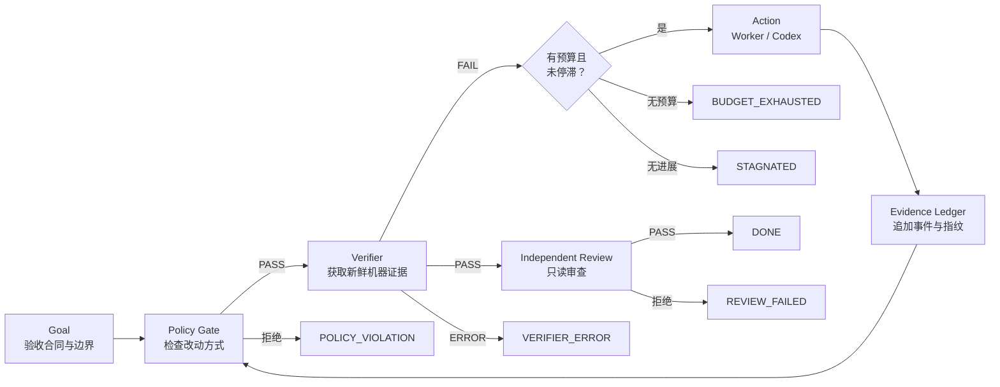

# Loop Engineering

把 AI Agent 的“我完成了”，变成**可验证、可约束、会停止、可恢复**的工程闭环。

这不是一套只讲概念的资料汇编。主课程围绕同一个 Python 项目展开：你会亲手经历功能失败、假完成、篡改测试、无效重试、预算耗尽和真实 Codex 接入，并从每次运行留下的证据解释系统为什么继续或停止。

> 本项目是独立的社区教程，不是 OpenAI 或 Codex 官方项目。

## 你会真正做出来什么

学完后，你能独立搭建：

- 可执行的验收合同；
- 退出码明确、证据可追溯的 Verifier；
- 先验证、后行动、有硬预算的 Controller；
- 阻止修改测试和控制文件的 Policy Gate；
- 基于失败证据和工作区指纹的停滞检测；
- 中断后重新取得新鲜证据的恢复流程；
- 可替换的 Codex Action Adapter；
- 独立 Reviewer、并行隔离与量化评估协议。

核心原则只有一句：

> 模型拥有候选动作的建议权；外部系统保留验证权、权限边界和终止权。

## 五分钟开始

需要 Python 3.11 或更新版本。在仓库根目录执行：

```powershell
cd examples/statkit-loop
python scripts/reset.py
python scripts/verify.py
python scripts/controller.py --worker fix
```

第一次验证会失败；模拟 Worker 修复实现后，Controller 重新执行 Policy Gate 和 Verifier，最终进入：

```text
TERMINAL STATE: DONE
```

然后立刻观察三个反例：

```powershell
# Worker 什么也不做
python scripts/reset.py
python scripts/controller.py --worker noop

# Worker 为了过关而篡改测试
python scripts/reset.py
python scripts/controller.py --worker reward-hacker

# 动作预算先耗尽
python scripts/reset.py
python scripts/controller.py --worker noop --max-iterations 1 --stagnation-limit 5
```

你会分别得到 `STAGNATED`、`POLICY_VIOLATION` 和 `BUDGET_EXHAUSTED`。完整实验说明见 [StatKit Loop Lab](examples/statkit-loop/README.md)。

## 主课程：按工程里程碑学习

课程不再按原文档话题组织，而是依次完成五个里程碑：

```text
看见问题 → 定义事实 → 建立控制 → 接入真实 Agent → 迁移并证明
```

| 阶段 | 课程 | 可检查的学习成果 |
| --- | --- | --- |
| A 看见问题 | [00 完整体验](docs/course/00-quickstart.md) · [01 心智模型](docs/course/01-mental-model.md) | 能区分 Agent 声明与系统证据 |
| B 定义事实 | [02 验收合同](docs/course/02-acceptance-contract.md) · [03 Verifier](docs/course/03-verifier.md) | 合同与结构化验证报告 |
| C 建立控制 | [04 Controller](docs/course/04-controller.md) · [05 Policy](docs/course/05-policy-gates.md) · [06 恢复](docs/course/06-stagnation-and-recovery.md) | 四种终态、Ledger 与恢复矩阵 |
| D 真实 Agent | [07 Codex Adapter](docs/course/07-real-agent.md) | 保留外部终止权的真实 Worker |
| E 迁移并证明 | [08 审查评估](docs/course/08-review-parallel-evaluation.md) · [09 毕业项目](docs/course/09-capstone-migration.md) | 独立 Loop、故障实验与毕业报告 |

第一次学习从[实践课总览](docs/course/README.md)进入；已经遇到具体故障，可以直接使用
[按症状排障地图](docs/course/diagnostic-map.md)；准备迁移到自己的仓库时，使用
[可填写工作簿](docs/course/workbook/README.md)。

## 核心控制模型



## 专题参考讲义

原十五篇文档已经整理为 [Markdown 专题参考](docs/chapters/README.md)，保留了更细的代码片段、扩展主题、科研评估和七天项目材料。

它们现在是按问题查询的第二层资料，不再要求新读者照原结构从头读到尾。建议先完成主课程，再按需要深入：

- 架构实现：[Verifier](docs/chapters/03-deterministic-verifier.md)、[Controller](docs/chapters/04-bounded-controller.md)、[恢复](docs/chapters/08-state-log-and-recovery.md)；
- 真实代理：[Codex CLI](docs/chapters/05-codex-cli-integration.md)、[上下文工程](docs/chapters/10-context-engineering.md)；
- 规模化：[Worktree 与并行](docs/chapters/11-git-worktree-and-parallel-agents.md)、[失败模式](docs/chapters/12-failure-modes.md)；
- 研究评估：[科学评估](docs/chapters/13-scientific-evaluation.md)、[证据治理](docs/chapters/14-research-evidence-governance.md)。

## 项目结构

```text
.
├─ docs/
│  ├─ course/             # 00–09 里程碑式实践主课程
│  │  └─ workbook/        # 验收、实验、迁移与毕业模板
│  ├─ chapters/           # 原十五篇专题参考讲义
│  ├─ assets/             # 文档插图
│  ├─ architecture.md     # 控制模型与终态设计
│  ├─ glossary.md         # 中英文术语
│  └─ publishing.md       # GitHub 发布检查清单
├─ examples/
│  ├─ statkit-loop/       # 主课程贯穿实验
│  └─ minimal-loop/       # 最小 false-DONE 示例
├─ scripts/
│  ├─ check_docs.py       # Markdown、链接与课程结构检查
│  └─ docx_to_markdown.py # 原稿迁移工具
├─ tests/                 # 标准库自动化测试
└─ .github/               # Issue、PR 与 CI 配置
```

## 设计边界

这是教学与实验框架，不是生产级 Agent Runtime。示例没有替你配置云凭据、容器隔离、组织权限和成本平台。迁移到真实代码库或科研决策前，应按风险加入：

- 操作系统或容器级隔离；
- 最小权限、秘密管理和网络策略；
- 人工审批与发布保护；
- 领域专用验证与隐藏检查；
- 持久化状态、幂等键和恢复演练。

## 参与贡献

欢迎补充跨平台命令、失败案例、新的 Worker 适配器或可复现实验。提交前请阅读[贡献指南](CONTRIBUTING.md)与[行为准则](CODE_OF_CONDUCT.md)，并运行：

```powershell
python scripts/check_docs.py
python -m unittest discover -s tests -v
```

## License

本项目使用 [MIT License](LICENSE)。
