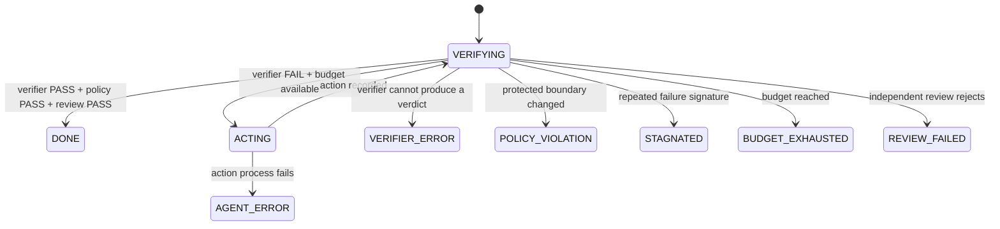

# 架构总览

[返回课程主页](../README.md)

Loop Engineering 关注的不是“模型能不能执行动作”，而是**系统如何可靠地决定下一步**。
一个最小闭环由八个要素组成。

## Loop Specification

| 要素 | 要回答的问题 | 推荐的机器可读产物 |
| --- | --- | --- |
| Goal | 什么状态才算完成？ | `goal.md`、验收条件 |
| State | 当前系统处于什么状态？ | `run_state.json` |
| Action | 谁可以提出或实施候选变更？ | Worker / Agent 适配器 |
| Verifier | 哪些机械证据支持 PASS？ | 退出码、`verification.json` |
| Policy | 哪些路径、权限和变更规模不可突破？ | `policy.json`、Diff 报告 |
| Memory | 哪些历史证据必须保留？ | append-only ledger、日志 |
| Budget | 最多允许多少轮、时间或成本？ | 预算计数器 |
| Stop | DONE、失败与错误分别如何终止？ | 命名终态 |

## 控制流

关键顺序是 `verify → decide → act → record → verify`。把 `act` 放在第一次验证之前，
会在任务已经完成、证据已经过期或恢复状态未知时制造不必要的变更。

## 为什么代理声明不能成为终态

代理的语言输出属于 Action 的结果，而不是 Verifier 的证据。它可能：

- 误读任务；
- 只检查 happy path；
- 修改测试以获得表面 PASS；
- 在工具调用失败后仍生成“完成”总结；
- 引用变化前产生的旧证据。

因此，`AGENT_CLAIM: DONE` 最多只能触发一次新的验证，不能直接写入系统终态。

## 终态设计

| 终态 | 语义 | 是否可以自动重试 |
| --- | --- | --- |
| `DONE` | 新鲜证据、策略门和审查门全部通过 | 否 |
| `BUDGET_EXHAUSTED` | 任务可能仍可完成，但本次预算耗尽 | 需重新授权 |
| `STAGNATED` | 多轮失败签名或工作区指纹无实质变化 | 需要改变策略 |
| `AGENT_ERROR` | 动作进程、工具或模型调用失败 | 视错误类型决定 |
| `VERIFIER_ERROR` | 无法形成可信判定 | 修复验证环境后再运行 |
| `POLICY_VIOLATION` | 受保护路径、权限或变更预算被突破 | 通常需要人工审查 |
| `REVIEW_FAILED` | 机械检查通过，但独立审查发现问题 | 返回带证据的新任务包 |

不要把这些状态压缩成一个布尔值。只有命名终态才能支持正确的恢复、告警和统计。

## 证据的新鲜度

一次验证至少应绑定：

- Git revision；
- 工作区 Diff 或内容指纹；
- 验证命令与版本；
- 开始、结束时间；
- 原始输出和退出码；
- 使用的策略版本。

只要其中影响判定的输入发生变化，旧 `PASS` 就不能继续证明当前工作区正确。

## 独立审查的边界

Reviewer 应当只读、拥有独立任务包，并且不能修改被审查对象。它适合发现：

- 测试没有覆盖的需求偏差；
- 为通过测试而引入的脆弱实现；
- 超出任务范围的变更；
- 安全、可维护性和解释边界问题。

Reviewer 不能替代确定性测试；确定性测试也不能替代高风险领域中的人工判断。
